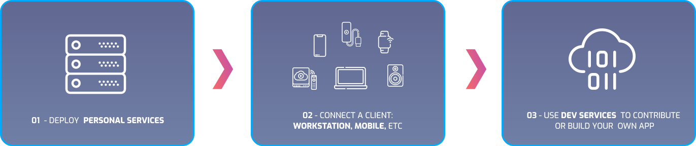

> Sway aims to create a fully hackable ecosystem which you can selfhost. It achieves a feature set catering to the modern hacker.

 

 

## How it works

 

   

 

Sway curates the best in open source and integrates it. Its made for DIY enthusiasts and developers. It is sustainable via the community and its open source nature. If you need a feature badly enough, you may:

- Create a git issue
- Create a pull request
- Add a tutorial to the [wiki](https://wiki.sway-me.xyz)
- Sponsor the project

By doing this you are also making it available to everyone else. Here are some  features in other repos needed for system integration: [unimplemented dependencies](details/unimplemented-dependencies).
:::note
If you have questions about this please visit the [FAQ](details/FAQ.md)
:::

