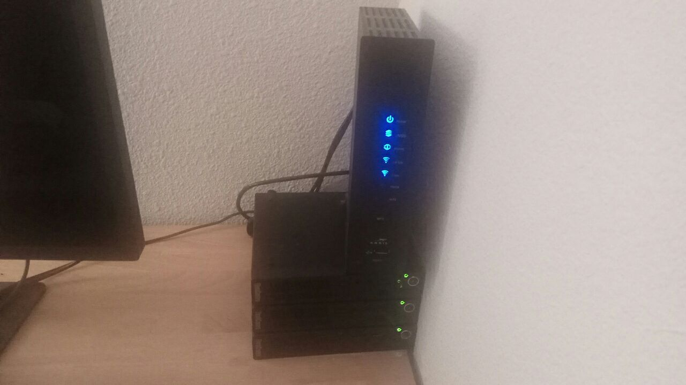

import Icons from '../../src/components/Icons';
import glossary from '../../data/glossary.json';


<Icons
    data={glossary.filter(({category}) => category === 'personalServices')}/>

> Get some (used) desktops, run these services and connect your apps.

<br/>


Personal Services are used to replace default apps, e.g photo, music, videos, and todo lists. They can be configured to have an android, web, and terminal client.  It aims to have feature parity or surpass a default apps in any ecosystem.

It generates a set of docker compose files and creates a git repo of config files. These files will deploy selected services to a docker swarm.

<br/>


:::note
This asks for some proficiency linux admin. If you get stuck, first look at the [asciinema videos](#asciinema). Then look at the related documentation.
:::

## Requisites
### [Hardware](recommended-hardware.mdx)
These are the min reqs. However, the more servers the better. All services have been tested on just two servers.

- At least two 16GB 500GB i5 servers
- A modem/router with port forwarding, including 80/443
- Ethernet Cables

If you are also installing `dev-services` you can put all dev and personal services across three servers.

<br/>



<blockquote style={{fontSize: 14}}>
    Working Setup with three regular servers.
    All <code>dev-services</code> and <code>personal-services</code> are
    distributed amongst them. If you choose two forgo either `dev-services` or
    `personal-services` , then you only need two servers.
</blockquote>


### Accounts/APIs
- [Namecheap](https://namecheap.com) domain for personal use. The system is designed to have two separate domains. Do not use the dev services domain. We also recommend namecheap's privatemail service. Its reliable, cheap and most importantly you can use your domain.

- [Namecheap](https://www.namecheap.com/support/knowledgebase/article.aspx/9739/63/api-faq) API key *(This is optional but it makes things easier. I just waited for a sale and bought 20 domains for under a buck each.)*

- ISP account that offers port forwarding on all ports. Preferably with a static IP. If you can't swing the static IP, checkout the [FAQ](../FAQ).


## Installation

### Debian
```shell
sudo apt-key adv --keyserver hkp://keyserver.ubuntu.com:80 --recv-keys 379CE192D401AB61
echo "deb https://deb.sway-me.xyz stable main" | sudo tee -a /etc/apt/sources.list
sudo apt -qq update && sudo apt -qq install sway
```


## Configuration
### Steps
This step works on a debian [clean installs](https://www.howtoforge.com/tutorial/debian-minimal-server) with [SSH server and standard system utilities](https://www.howtoforge.com/images/debian_buster_minimal_server/big/debian-10-server-33.png) installed. **Must** be done in the  following order

1. Run the following on each consecutive worker server (replace `$N` with the next consecutive number):

 ```shell
 sway docker setup worker --number=$N
    ````
1. Lastly, Run the following on the manager server:

 ```shell
 sway docker setup manager
 ````


## Deployment

```shell
sway personal init
```
After you have followed all the prompts, you should be able to reach the dashboard at: `https://dash.$PERSONAL_DOMAIN`

## Asciinema
These videos are here to help. There is one for a worker and one for the manager.
### Worker
### Manager

